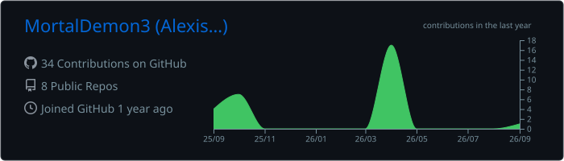
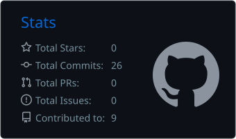
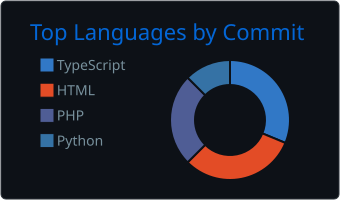

<!-- ═══════════════════════════ BANNIÈRE ═══════════════════════════ -->
<p align="center">
  
</p>

<p align="center">
  <a href="https://portefolio.andries.icu">
    
  </a>
</p>

<p align="center">
  <a href="https://portefolio.andries.icu"></a>
  
  
</p>

---

## `$ cat about_me.txt`

```yaml
nom:        Alexis Andries
alias:      MortalDemon3
formation:  BTS SIO — option SISR @ EPSI Montpellier
localisation: Montpellier, France 🇫🇷
focus:      [ Réseau, Virtualisation, Linux, Cybersécurité ]
en_cours:   Préparation CCNA 200-301
cherche:    Stage de 2e année (admin systèmes & réseaux)
fun_fact:   Je fais tourner un homelab complet… et je plonge en sidemount 🤿
```

---

## 🧰 `$ ls ~/stack`

<p align="center">
  
  <br/><br/>
  
</p>

<p align="center">
  
  
  
  
  
  
  
  
  
  
</p>

---

## 🖥️ `$ neofetch --homelab`

```text
      ▄▄▄▄▄▄▄▄▄▄▄         MortalDemon3@homelab
    ▄█▀▀       ▀▀█▄       ─────────────────────────────────────────
   ██   ▄▀▀▀▀▀▄   ██      Hyperviseur : Proxmox VE (LXC + VM)
   ██  █ ◉   ◉ █  ██      Réseau      : UniFi • VLANs segmentés • DMZ isolée
   ██   ▀▄ ▄▄ ▄▀  ██      VPN         : WireGuard (split tunneling)
    ▀█▄   ▀▀▀   ▄█▀       DNS         : AdGuard Home (primaire + secondaire sur RPi)
      ▀▀▀▀▀▀▀▀▀▀▀         Stockage    : TrueNAS SCALE • NFS • backups vzdump
                          Sécurité    : CrowdSec • fail2ban • honeypot Cowrie • Trivy
                          Monitoring  : Uptime Kuma • bot Discord maison • alertes PAM
                          Git         : GitLab CE auto-hébergé
                          Exposition  : Nginx Proxy Manager + Cloudflare
```

---

## 🚀 `$ ls ~/projets`

| Projet | Description | Stack |
|:--|:--|:--|
| 🕵️ **OSINTBox** | Boîte à outils OSINT web (générateur QR, chat chiffré), CI/CD GitHub Actions — [osintbox.andries.icu](https://osintbox.andries.icu) |   |
| 📡 **pve-monitoring** | Bot Discord de supervision Proxmox avec commandes slash (`/ban`, `/unban`) |   |
| 🎮 **[mii-project](https://github.com/MortalDemon3/mii-project)** | Plateforme de mini-jeux multijoueurs dans le navigateur (projet BTS) |   |
| 🏨 **[hotel-neptune](https://github.com/MortalDemon3/hotel-neptune)** | Site web de gestion d'hôtel |   |
| ⚓ **[Bataille-Navale](https://github.com/MortalDemon3/Bataille-Navale)** | Bataille navale en terminal, solo vs IA ou 2 joueurs |  |
| 🐍 **[Projet-python](https://github.com/MortalDemon3/Projet-python)** | Application orientée objet en Python |  |

---

## 📊 `$ git log --stats`

<p align="center">
  
</p>
<p align="center">
  
  
</p>
<p align="center">
  
</p>

---

## 🐍 `$ ./snake --eat-contributions`

<p align="center">
  <picture>
    <source media="(prefers-color-scheme: dark)" srcset="https://raw.githubusercontent.com/MortalDemon3/MortalDemon3/output/github-contribution-grid-snake-dark.svg"/>
    <source media="(prefers-color-scheme: light)" srcset="https://raw.githubusercontent.com/MortalDemon3/MortalDemon3/output/github-contribution-grid-snake.svg"/>
    
  </picture>
</p>

---

<p align="center">
  
</p>


